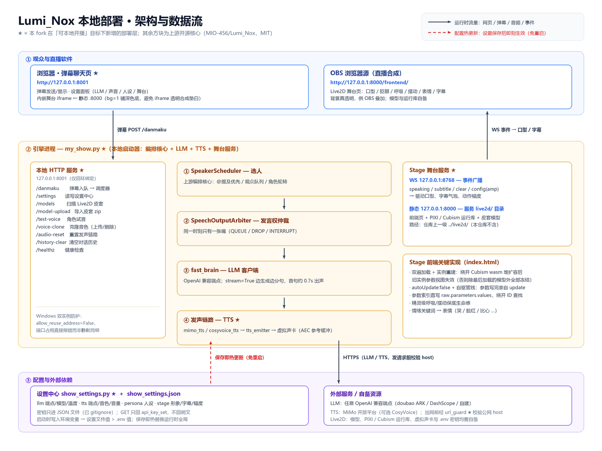

# Local deployment layer

Upstream Lumi_Nox is an **open core**: it ships the coordination engine and the
realtime dual-AI pipeline, and expects you to bring your own LLM endpoint, TTS
voices, Live2D models and personas (see *What you need to bring* in the main
README). This fork adds the missing pieces so the project can actually be started
and operated on one Windows machine: a launcher with a web control room, a
settings panel, a MiMo TTS provider, and the live stage.



Everything marked ★ in the diagram is added by this fork. Boxes without ★ are the
upstream open core, reused as-is. To regenerate the diagram after editing the
deployment layer, run `python docs/assets/make_architecture_diagram.py` (needs
Pillow and the Windows 微软雅黑 fonts).

## What the deployment layer adds

| File | Role |
|---|---|
| `my_show.py` | Launcher: wires the upstream coordinator (`EventBus` / `StateMachine` / `SpeakerScheduler` / `SpeechOutputArbiter`) to a real LLM and TTS, and serves the danmaku chat page and the live stage. |
| `show_settings.py` | Settings center: one JSON file drives LLM / TTS / persona / stage config, applied without a restart. |
| `mimo_tts.py` | MiMo (Xiaomi) streaming TTS synth — a drop-in peer of `cosyvoice_tts.IndependentSynth`. |
| `url_guard.py` | Pre-flight URL check: only `http`/`https`, and the host must resolve to a public address. |
| `tests/test_deploy_smoke.py` | Standard-library-only smoke tests for the settings store, the emitter lifecycle and the Live2D zip import. |
| `docs/` (this file) | Deployment notes. |

The stage frontend (`live2d/frontend/index.html` plus the PIXI / Cubism runtimes
and the Live2D models themselves) lives **outside** this repository, in the
sibling `live2d/` directory. `my_show.py` serves it but does not contain it —
models and runtimes are yours to supply, and the game binaries are not published.

## Running it

```bash
pip install -r requirements.txt
cp .env.example .env        # fill in at least one LLM endpoint and one TTS key
python my_show.py --web-chat
```

Then open `http://127.0.0.1:8001/`. If `../live2d/frontend/` exists, the stage
comes up too (WS `127.0.0.1:8768`, static `127.0.0.1:8000`); add `--no-stage` to
skip it. Add `--no-tts` for subtitles only.

All three servers bind loopback only. For OBS, add a browser source pointing at
`http://127.0.0.1:8000/frontend/` — it renders the stage with a transparent
background so your scene shows through. The chat page embeds the same page with
`bg=1`, which paints a dark background instead: Chromium composites transparent
WebGL canvases inside an iframe onto white, so without it the embedded stage would
sit on a white rectangle.

## Data flow of one danmaku

1. The browser posts to `/danmaku`; `SpeakerScheduler` decides who answers
   (@-mentions first, then the viewer queue, then rotation).
2. The chosen character requests the floor from `SpeechOutputArbiter` — only one
   voice holds it at a time.
3. `fast_brain` streams the reply (`stream=True`), splitting on punctuation as
   tokens arrive, so the first sentence starts playing in roughly 0.7 s instead of
   waiting for the whole paragraph.
4. Each sentence goes to the TTS synth (`mimo_tts` or `cosyvoice_tts`) behind
   `tts_emitter`; PCM lands on the virtual audio cable that the voice changer or
   OBS listens to. The AEC reference buffer gets the same audio.
5. `Stage` broadcasts `speaking` / `subtitle` / `clear` over WS `:8768`; the stage
   page drives mouth movement, expressions and subtitles from those events.

## Settings center

`show_settings.json` (gitignored — it holds API keys) carries four groups:

| Group | Fields | How it takes effect |
|---|---|---|
| `llm` | `base_url`, `api_key`, `model`, `temperature` | Rebuilds the OpenAI client and hot-swaps the `fast_brain` globals; the next sentence uses it. |
| `tts` | `base_url`, `api_key`, `model`, `lumi_voice`, `nox_voice`, `volume` | Hot-swaps the `mimo_tts` endpoint globals; voice changes go through the environment and rebuild the speaking chain. |
| `persona` | `lumi`, `nox` | Overwrites `my_show.PERSONAS` in place; the next sentence uses it. |
| `stage` | `subtitle`, `lumi_model`, `nox_model`, `amplitude` | Amplitude travels over WS live; model/subtitle changes reload the stage iframe. |

Two mechanisms keep this safe and simple:

- **Precedence.** `my_show.py` calls `load_and_apply_env()` *before* importing
  `fast_brain` / `mimo_tts`, writing non-empty values into the environment. The
  modules' later `load_dotenv()` calls do not overwrite existing variables, so
  "settings file beats `.env`" falls out for free and the upstream read paths
  never had to change.
- **Secrets.** `api_key` is written only to the JSON file. The read API returns
  `api_key_set` as a boolean and never the key itself; submitting an empty key
  keeps the stored one.

## Voice cloning

MiMo has no separate "register voice" endpoint: the reference audio is inlined
into every synthesis request as a data URI under `audio.voice`, using the
`mimo-v2.5-tts-voiceclone` model. `mimo_tts.py` therefore needed no changes — the
reference travels in the same field a preset voice would.

Uploads go to the settings panel (a name plus an mp3/wav under 10 MB), are stored
in `cloned_voices/` (gitignored — these are your recordings) and are registered in
the `clones` group of the settings file. Reference audio is trimmed and downsampled
when ffmpeg is available, because the whole clip is inlined into every request and
smaller clips synthesize faster. Selecting a clone writes `clone:<name>` as the
character's voice.

## Live2D model import

Drag-and-drop model setup is not required: the settings panel accepts a model zip
and unpacks it into `../live2d/<name>/`. The import audits member names explicitly
(absolute paths, drive letters and `..` are rejected — the audit runs *before*
hidden-file filtering so `..` cannot be swallowed by a dot-prefix rule), then
extracts with `zipfile.extract` and strips a redundant single top-level wrapper
directory. At least one Cubism 4 model (`*.model3.json`) must be present with its
`Moc` and textures readable; on any failure the whole import rolls back and leaves
nothing behind. `/models` rescans the directory, so newly imported models appear in
the character dropdown immediately — duplicates get a timestamp suffix instead of
overwriting.

Only zip is supported (rar would need an extra unpacker) and only Cubism 4
(`*.model3.json`); legacy Cubism 2 models are not, because the shipped runtime is
cubism4.

## Notes from the field

- **Two instances can silently share one port on Windows.** `http.server` defaults
  to `allow_reuse_address = 1`, which on Windows maps to `SO_REUSEADDR`: a second
  process binds the same port without error and requests land on either process at
  random. `_ShowHTTPServer` sets it to `False` so a port clash fails loudly.
- **A character can go mute after a few turns.** `MimoSynth` opens one stream per
  utterance and closes itself in `finish()`; the wrapping `IndependentTTSEmitter`
  keeps its own `_opened` flag, and leaving it set makes every later `feed()` think
  the stream is still open, dropping all sentences silently. `finish()` / `abort()`
  now reset the flag. The older "rebuild every 8 utterances" workaround was hiding
  this bug and has been removed.
- **Every model but the last stops animating.** The Cubism wasm runtime hands each
  model instance views into the wasm heap; loading a further model grows that heap
  and detaches the earlier views. The detached instance still reads and writes
  consistently, so nothing looks broken — the deformation simply never sees the
  written values, freezing the model in its load pose. The stage page therefore
  loads all models first and then rebuilds every instance (so no further growth
  follows), drives updates itself with `autoUpdate: false`, and writes parameters
  by index straight into `raw.parameters.values`.
- **`curl -d '中文'` from Git Bash is not UTF-8.** It sends console-codepage (GBK)
  bytes and the server decodes garbage. Use `--data-binary @file` when testing
  Chinese JSON by hand; browsers always send UTF-8.

## Verification

```bash
python -m unittest discover -s tests -v
python -m compileall -q .
```

The deployment tests are standard-library only and skip themselves when the
deployment files are absent, so the upstream CI job keeps working unchanged. They
cover the settings round-trip, the emitter lifecycle regression above, and the zip
import (wrapper stripping, missing-texture rollback, zip-slip rejection, duplicate
naming).
